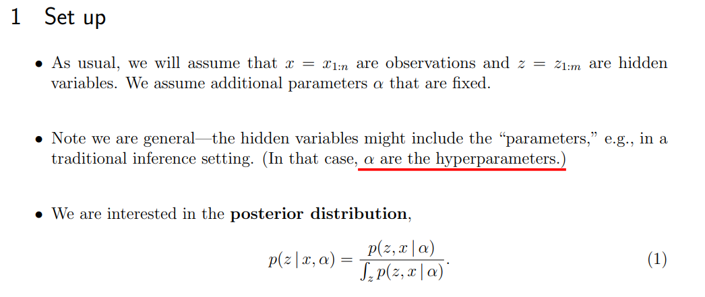
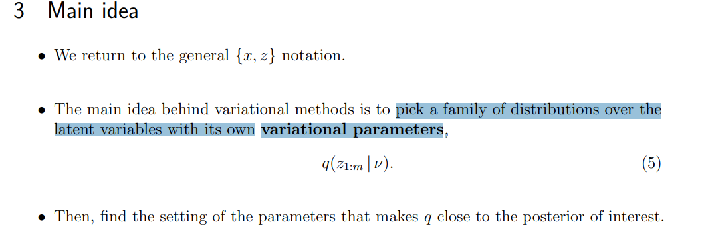
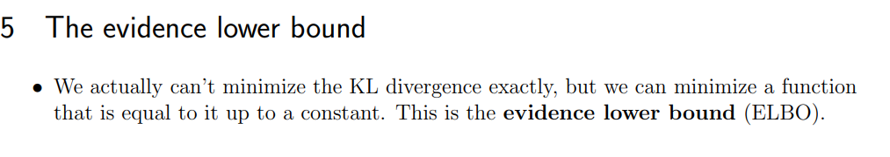
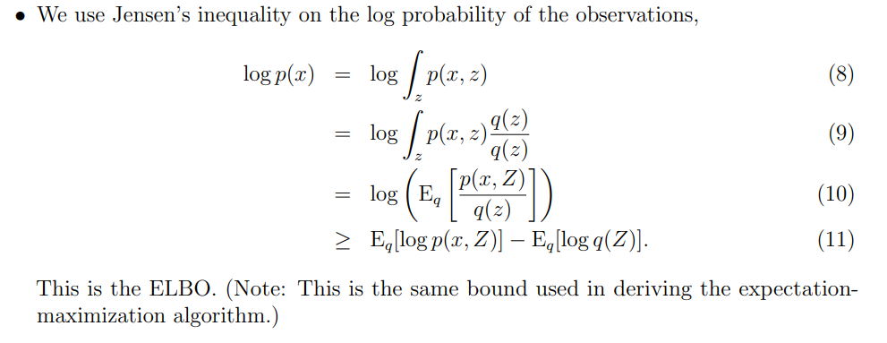
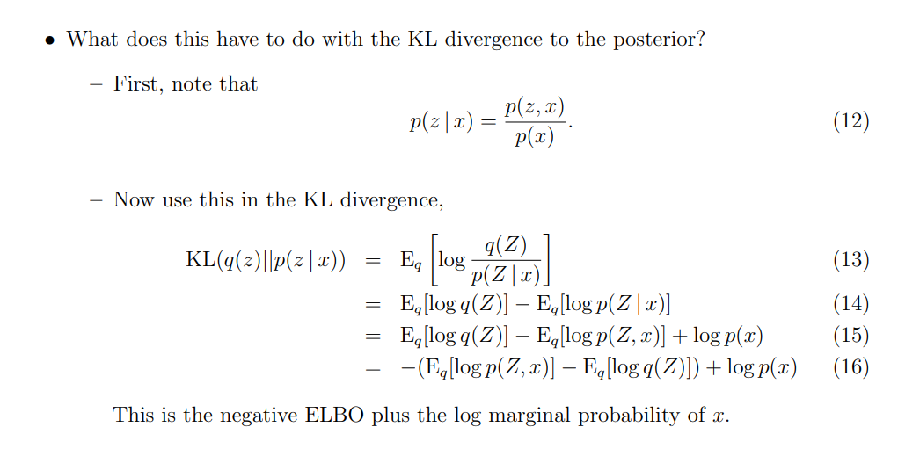
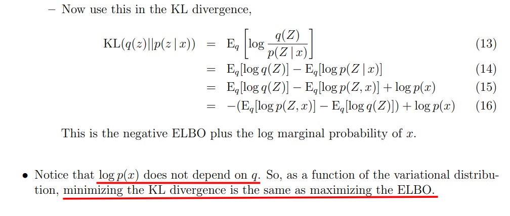
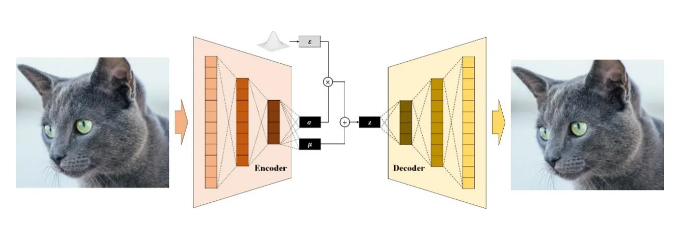
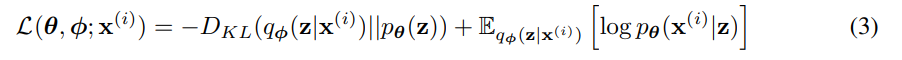
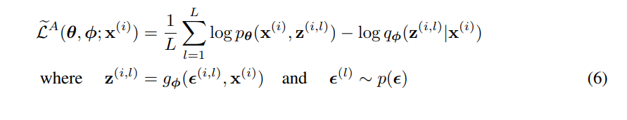
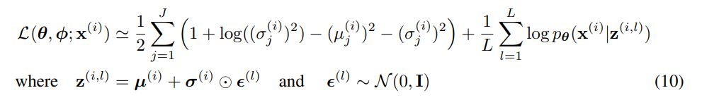

# Variational Inference

[bilibili](https://www.bilibili.com/video/BV1Gs4y157BU/?spm_id_from=333.1007.top_right_bar_window_history.content.click&vd_source=5e51683fbf5f719fff3f81bceedb641d)

<https://www.cs.princeton.edu/courses/archive/fall11/cos597C/lectures/variational-inference-i.pdf>

# VAE

<https://arxiv.org/pdf/1312.6114>

**$z -> \epsilon$ is reparametric trick**

**SGVB estimator:**

**VAE:**

