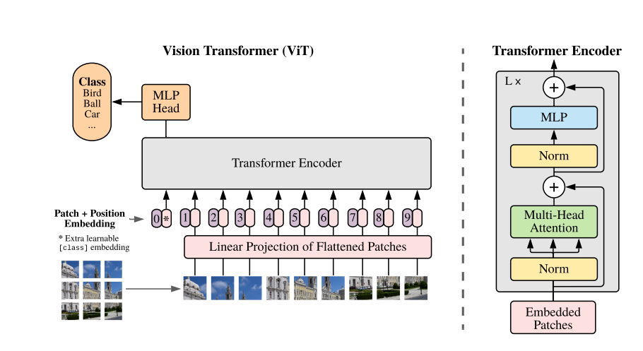

## transformer

<https://www.arxiv.org/pdf/1706.03762>

<https://d2l.ai/chapter_attention-mechanisms-and-transformers/transformer.html>

encoder decoder

self-attention, multi-head attention

positional encoding

embedding

regularization

## ViT

https://arxiv.org/pdf/2010.11929

## swin transformer

<https://arxiv.org/pdf/2103.14030>

